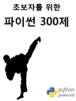
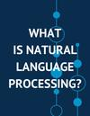

# [3-2] 머신러닝2 수업 실습하기.

## 중간고사 범위

1. 초보자를 위한 파이썬 300제

* 위키독스 책 링크 : [초보자를 위한 파이썬 300제](https://wikidocs.net/book/922)
* 책 표지 사진  

2. 딥 러닝을 이용한 자연어 처리 입문

* 위키독스 책 링크 : [딥 러닝을 이용한 자연어 처리 입문](https://wikidocs.net/book/2155) 
* 책 표지 사진  

